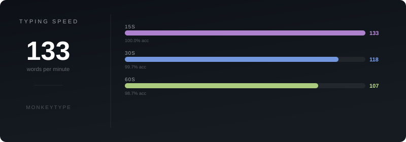
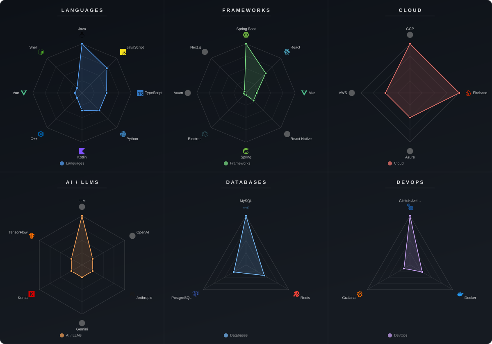

# Welcome!

<!-- summary-start -->
This developer focuses on full-stack application development, building robust microservice architectures with Java and Kotlin Spring Boot, and crafting engaging user interfaces using React, Vue, and React Native. Their expertise extends to integrating cutting-edge AI/LLM technologies, computer vision, and orchestrating complex cloud deployments. Additionally, they delve into embedded systems programming with Arduino and Raspberry Pi for IoT and hardware-interfacing projects.
<!-- summary-end -->

<!-- rating-start -->

<!-- rating-end -->

<!-- monkeytype-start -->

<!-- monkeytype-end -->

<!-- tech-charts-start -->

<!-- tech-charts-end -->

<!-- tech-start -->
          
<!-- tech-end -->
