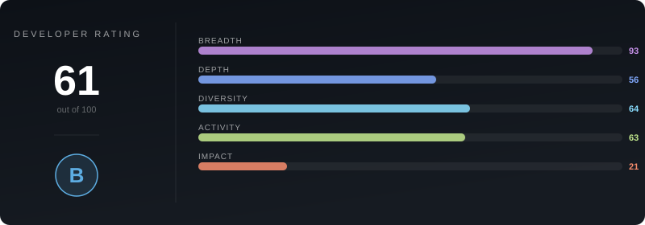
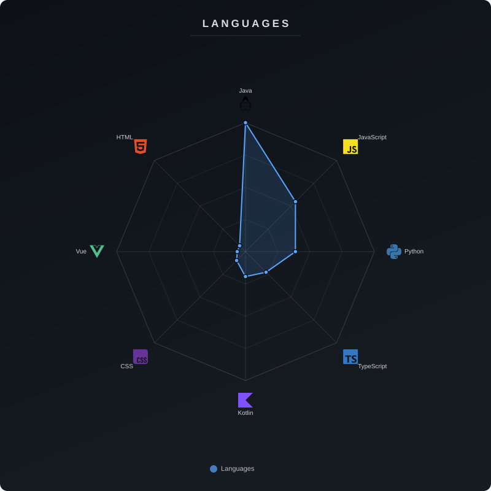
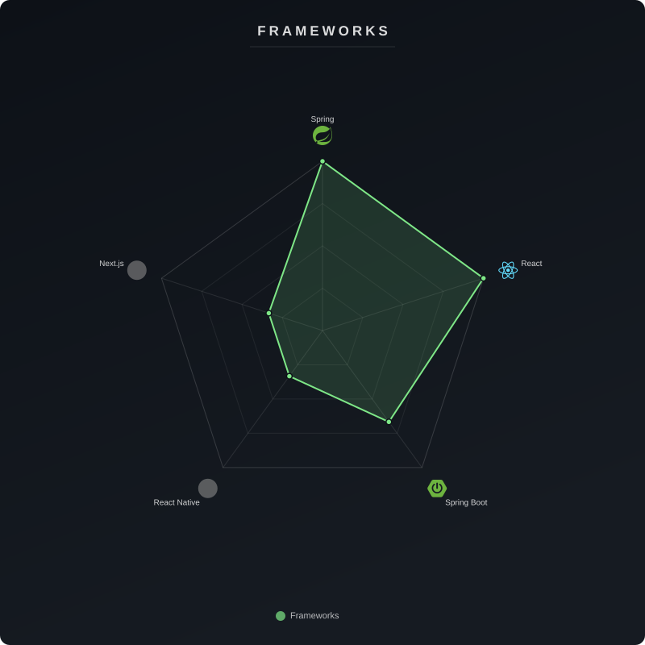

# Welcome!

<!-- summary-start -->
This developer is proficient in full-stack web and microservice development, primarily utilizing Java with Spring and Kotlin for robust backend architectures. On the frontend, they specialize in creating dynamic user interfaces and mobile applications using JavaScript/TypeScript with frameworks like React, Vue, and React Native. Beyond web development, their interests span embedded systems with C++ and Arduino, along with practical applications of AI/ML and Python-based tools for data analysis and automation.
<!-- summary-end -->

<!-- rating-start -->

<!-- rating-end -->

<!-- tech-charts-start -->

<!-- tech-charts-end -->

<!-- tech-start -->
          
<!-- tech-end -->
